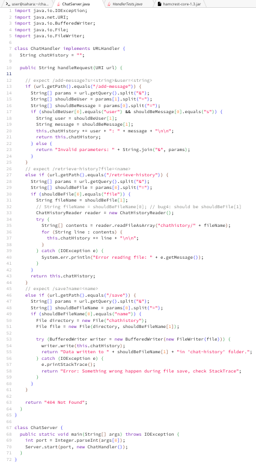
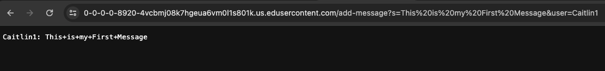
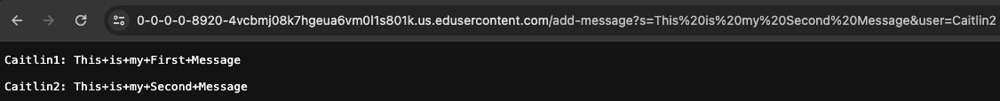
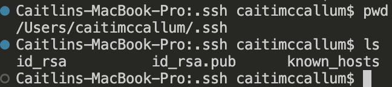
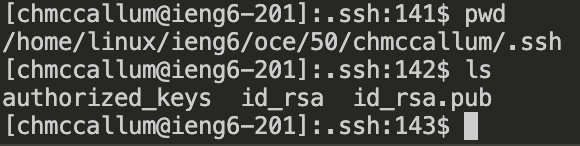
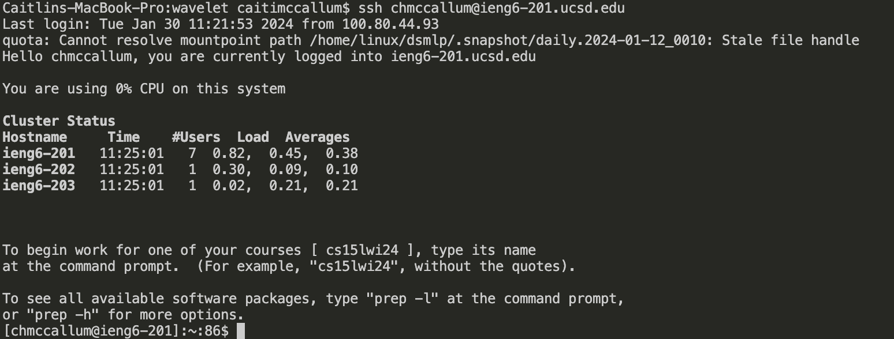

# Lab 2: Servers and SSH Keys (Week 3)
Caitlin McCallum
## Part 1 
### Chat Server Code: 

## First Message:

i. *Which methods in your code are called?:*

The method `handleRequest(URI url)` is called in the ChatServer class and the `start(int port, URLHandler handler)` method of the Server class is called in the ChatServer class

ii. *What are the relevant arguments to those methods, and the values of any relevant fields of the class?*

the url `https://0-0-0-0-8920-4vcbmj08k7hgeua6vm0l1s801k.us.edusercontent.com/add-message?s=This%20is%20my%20First%20Message&user=Caitlin1` is an arguement for `handleRequest(URI url)`. The port I entered in the terminal when I ran `java ChatServer 8920` was 8920, this serves as the arguement for `int port` in the start method and `new ChatHandler()` is the arguement for `URLHandler handler`.

iii. *How do the values of any relevant fields of the class change from this specific request? If no values got changed, explain why.*

The if statement excecuted to revieve this action looks for `/add-message` in the path field of the URL. the String list `params` contains ["s=This%20is%20my%20first%20message", "user=Caitlin1"] as it contains the string split with a delimiter of '&'. Then the String list `shouldBeUser` contains ["user", "Caitlin1"] and the third String list `shouldBeMessage` contains ["s", "This%20is%20my%20first%20message"], then the String `user` is set to "Caitlin1" and the String `message` is set to "This%20is%20my%20first%20message". Finally `this.chatHistory` is updated with `user + ": " + message + "\n\n"`, which should be "Caitlin1: This+is+my+first+message" + newline + newline

## Second Message:

i. *Which methods in your code are called?:*

The method `handleRequest(URI url)` is called in the ChatServer class and the `start(int port, URLHandler handler)` method of the Server class is called in the ChatServer class

ii. *What are the relevant arguments to those methods, and the values of any relevant fields of the class?*

the url `https://0-0-0-0-8920-4vcbmj08k7hgeua6vm0l1s801k.us.edusercontent.com/add-message?s=This%20is%20my%20Second%20Message&user=Caitlin2` is an arguement for `handleRequest(URI url)`. The port I entered in the terminal when I ran `java ChatServer 8920` was 8920, this serves as the arguement for `int port` in the start method and `new ChatHandler()` is the arguement for `URLHandler handler`.

iii. *How do the values of any relevant fields of the class change from this specific request? If no values got changed, explain why.*

The if statement excecuted to revieve this action looks for `/add-message` in the path field of the URL. the String list `params` contains ["s=This%20is%20my%20second%20message", "user=Caitlin2"] as it contains the string split with a delimiter of '&'. Then the String list `shouldBeUser` contains ["user", "Caitlin2"] and the third String list `shouldBeMessage` contains ["s", "This%20is%20my%20second%20message"], then the String `user` is set to "Caitlin2" and the String `message` is set to "This%20is%20my%20second%20message". Finally `this.chatHistory` is updated with `user + ": " + message + "\n\n"`, which should be "Caitlin2: This+is+my+second+message" + newline + newline

## Part 2

i. *The absolute path to the private key for your SSH key for logging into ieng6*

The private key file in this directory is `id_rsa`

ii. *The absolute path to the public key for your SSH key for logging into ieng6*

The public key file in this directory is `id_rsa.pub`

iii. *A terminal interaction where I log into my ieng6 account without being asked for a password*

## Part 3

In this lab I learned several new things about using my local terminal on VSCode, I hadn't used it to navigate through my file system. I was honestly pretty amazed at the relative ease of navigating through the terminal using pwd and ls commands. Another thing I didn't know that I could do is use an SSH key for easy access into my course-specific account, just last week I had no idea how to even access a remote server. 
